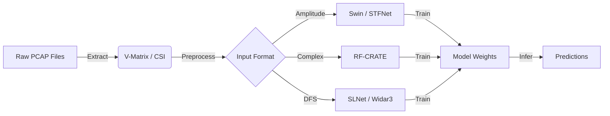

# 📡 Wi-Fi Sensing Toolkit
> *Unleash the Hidden Intelligence in Your Airwaves*

  

**Forget cameras. Your Wi-Fi router is the sensor of the future.**

Welcome to the **Wi-Fi Sensing Toolkit**, a powerful, unified framework designed to extract, process, and analyze Channel State Information (CSI) and Beamforming Reports (BFR) from 802.11ac/ax traffic. Whether you're researching human activity recognition, indoor localization, or device identification, this toolkit provides the end-to-end pipeline you need—from raw PCAP files to trained deep learning models.

---

## 🚀 Why This Toolkit?

*   **⚡ Frictionless Extraction**: Turn raw `.pcap` files into tensor-ready V-Matrices without the headache. Supports **802.11ac (VHT)**, **802.11ax (HE)**, and **SU-MIMO**.
*   **🧠 State-of-the-Art Models**: Built-in implementations of cutting-edge architectures like **RF-CRATE** (Masked Autoencoders for RF), **STFNet**, **SLNet**, and **Swin Transformers** adapted—ready to train out of the box.
*   **🛠 Unified Pipeline**: One script to rule them all. `run_pipeline.py` handles extraction, training, testing, and inference with a simple CLI.
*   **📊 Visualization**: See what your Wi-Fi sees with integrated plotting tools for BFR data.

---

## 🧠 The Models

We include a suite of powerful models tailored for RF data:

| Model | Besst For | Description |
| :--- | :--- | :--- |
| **RF-CRATE** | **Representation Learning** | uses Masked Autoencoders (MAE) to learn robust features from unlabelled RF data. |
| **Swin Transformer** | **High Accuracy** | A hierarchical vision transformer adapted for RF spectrograms. |
| **STFNet** | **Time-Frequency Analysis** | leverage Short-Time Fourier Transforms (STFT) for capturing dynamic motion patterns. |
| **SLNet** | **Sequence Modeling** | Optimized for temporal sequence learning in sliding windows. |
| **Widar3** | **Baseline Comparison** | A faithful implementation of the classic Widar3 recognition model. |

---

## ⚙️ The Pipeline

The system is orchestrated by `run_pipeline.py`, which abstracts away the complexity of data loading, training loops, and evaluation.



---

## ⚡ Quick Start

### 1. Installation

```bash
git clone https://github.com/Nirtzur0/wifi-sensing.git
cd wifi-sensing
pip install -e .
```

### 2. Prepare Your Data

Simply organize your `.pcap` files. The system can automatically infer labels from directory structures or filenames (see `PCAP_TRAINING_GUIDE.md` for details).

```bash
Data/
└── MyDataset/
    └── Processed/
        ├── LivingRoom/
        │   └── Walking/
        │       └── capture.pcap
        └── ...
```

### 3. Run the Pipeline!

**Train an Activity Classifier with Swin Transformer:**

```bash
python run_pipeline.py --model swin_t --task activity --data Data/MyDataset --mode train
```

**Run a Quick Integrity Check:**

```bash
python run_pipeline.py --mode check --data Data/MyDataset
```

Notes for `--mode check`:
- For PCAP-based runs, `check` mode limits decoding via `num_to_process` (default: 30) to keep the smoke test fast.
- If your PCAP requires a specific transmitter address filter, set `station_address` in your YAML (or adjust the CLI/config).

**Run Inference on a Specific File:**

```bash
# Detailed inference commands are available via the CLI
wifi-sensing infer --pcap data.pcap --config configs/my_best_model.yaml --address AA:BB:CC:DD:EE:FF
```

---

## ✅ Tests

Some environments have globally-installed pytest plugins that are incompatible with Python 3.12.
To keep the test run deterministic, use the repo wrapper:

```bash
./scripts/test.sh
```

(Equivalent: `PYTEST_DISABLE_PLUGIN_AUTOLOAD=1 python -m pytest`)

---

## 🎛 Configuration & Customization

The toolkit is highly configurable via YAML. Check `wifi_sensing_lib/configs/` for templates.

*   **`label_type`**: `activity`, `room`, `station` (identity).
*   **`format`**: `amplitude`, `phase`, `complex`, `dfs` (Doppler).
*   **`seq_length`**: Control the time window for your samples.

To create a custom experiment, just pass your specific arguments to `run_pipeline.py`—it automatically overlays them on the default config!

---

## 📂 Project Structure

*   `wifi_sensing_lib/`: The core library.
    *   `models/`: Neural network definitions.
    *   `training/`: Trainer logic and loops.
    *   `data/`: PCAP parsing and dataset loaders.
*   `run_pipeline.py`: The main entry point.
*   `pcap_logic`: Helper script for organizing datasets.

---

## 🤝 Contributing

Got a new model architecture or a faster extraction method? Pull requests are welcome! Let's build the future of RF sensing together.
