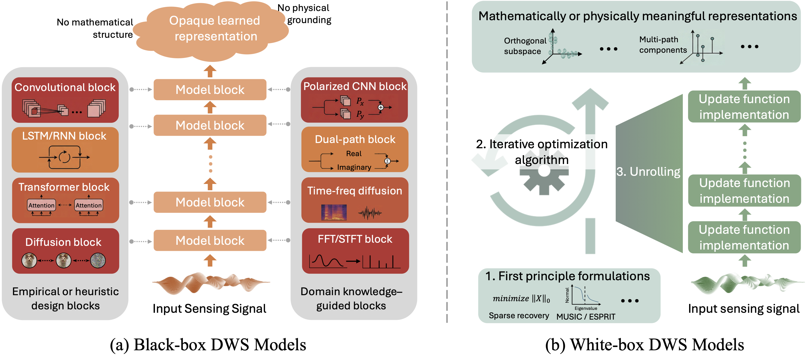
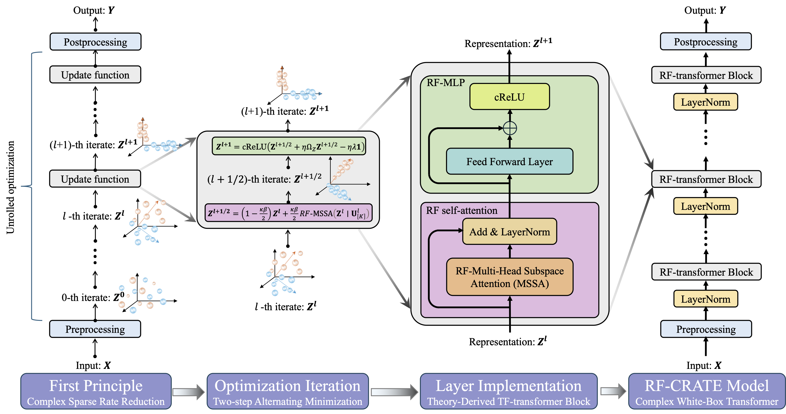
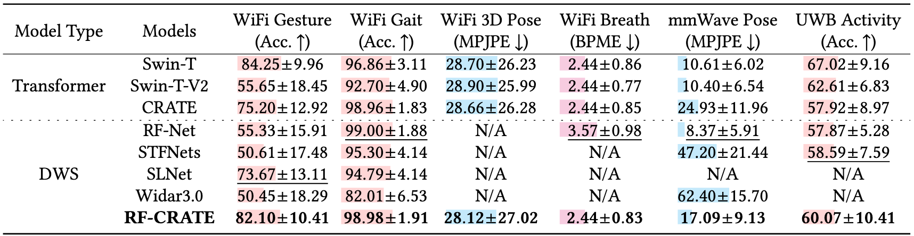

# White-Box Deep Wireless Sensing

## Black-box versus white-box paradigms in deep wireless sensing.


RF-CRATE is the first white-box model for radio-frequency (RF) sensing, grounded in the principle of complex sparse rate reduction. Unlike traditional black-box models in Deep Wireless Sensing (DWS), the architecture of RF-CRATE is derived directly from an underlying optimization program while still achieving comparable performance.

Key features:
- **Complex-Valued White-Box Transformer**: Extends real-valued white-box transformers to the complex domain through non-trivial theoretical derivations
- **CR-Calculus Framework**: Enables construction of fully complex-valued architectures with theoretically derived self-attention and MLP modules
- **Subspace Regularization (SSR)**: A novel regularization strategy that encourages feature diversity, improving performance by an average of 19.98% across multiple sensing tasks
- **Demonstrated Effectiveness**: Achieves an average classification gain of 5.08% and reduces regression error by 10.34% across diverse sensing tasks


## Overview


## Installation

### Clone the repository
```bash
git clone https://github.com/rfcrate/RF-CRATE.git
cd RF-CRATE
```


### Create and activate a conda environment (optional but recommended)
```bash
conda create -n rfcrate python=3.8.18
conda activate rfcrate 
```

### Install dependencies
```bash
pip install -r requirements.txt
```


## Dataset Preparation
You can download the datasets from the following links:
- [GaitID and Widar3.0](https://tns.thss.tsinghua.edu.cn/widar3.0/)
- [OPERAnet](https://figshare.com/collections/A_Comprehensive_Multimodal_Activity_Recognition_Dataset_Acquired_from_Radio_Frequency_and_Vision-Based_Sensors/5551209)
- [HuPR](https://github.com/robert80203/HuPR-A-Benchmark-for-Human-Pose-Estimation-Using-Millimeter-Wave-Radar)

To enhance reproducibility, we will release both the data preparation code and the processed datasets.
Please note that dataset names in the paper differ from those in the codebase:
- Widar3.0 is referenced as Widar3 in the code
- OPERAnet is referenced as OperaNet in the code
- HuPR maintains the same name in both paper and code
- GaitID is referenced as widargait in the code
- WiP-pose is referenced as OctonetMini in the code
- WiP-breath is referenced as RPI in the code

All the datasets should be processed and stored in the `Open_Datasets` folder.


## Experiment Configuration Details
We maintain the configuration file in .yml format for each experiment, which contains the parameters for models, datasets, and training settings. The following is the description of the parameters:

<details>

<summary>Experiment Info</summary>

| Parameter         |Valid Values | Default|Description |
|-------------------|--------------|--------------|--------------|
| task              | Any string   |  N/A       | The Description of the task         |
| init_rand_seed    | int numbers | 41          |the seed for all the random setting for reproducibility             |
| tqdm_disable      | True/False  | False       |Disable all the tqdm progress bar or not            |
| tensorboard_folder       | path string | 'runs/'    |The folder to store the tensorboard            |
| trained_model_folder       | path string | 'weights/' |The folder to store the model weights            |
| model_save_enable       | True/False | False      |save the model or not            |
| log_folder       | path string | 'logs/'    |The folder to store inputs and ouputs of the model when testing            |
| log_enable       | True/False | False      |save the above log or not            |
|                      |              |            |                                                              |

</details>

<details>

<summary>Training settings</summary>

| Parameter         |Valid Values | Default|Description |
|-------------------|--------------|--------------|--------------|
| num_epochs              | int numbers | 200         | the number of epochs for training |
| early_stop    | int numbers < num_epochs | 15        |the early stop threshold for training             |
| batch_size      | int numbers | 32          |batch size            |
| num_workers        | int numbers | 16          |the number of workers for dataloader            |
| optimizer       | 'AdamW',  'Adam', 'Lion', | 'AdamW'    |the optimizer type, 'Lion' is only suitable for real-valued NN, not for RF-CRATE.            |
| lr       | Float number | 0.00005     |the learning rate            |
| weight_decay       | Float number | 0.0001      |the weight decay in the optimizer            |
| momentum       | Float number | 0.5         |the momentum in the optimizer            |
| max_norm       | Float number/None | None        |the maximum norm for the gradient clipping when it is not None            |
| criterion       | 'mse', 'cross_entropy', 'label_smoothing', 'bone_loss' | N/A         |the loss functions:: 'mse': the mean square error loss for general regression tasks; 'cross_entropy' or 'label_smoothing': used for te classification tasks; 'bone_loss': the combination of the bone length loss and the location mse loss for the pose estimation tasks.            |
| resume_training       | False/path string | False       |resuming the training or not. If resuming, the value is the path to the checkpoint that used for resuming.            |
| metric       | 'accuracy', 'f1_score', 'precision', 'recall', 'mpjpe_2d', 'mpjpe_3d' | N/A        |the metric for quantify the performance of the model that reported in the tensorboard. 'mpjpe_2d' and 'mpjpe_3d' are used to pose estimation tasks.            |


</details>


<details>

<summary>Model settings</summary>

### RF-CRATE Model
| Parameter         |Valid Values | Default|Description |
|-------------------|--------------|--------------|--------------|
| model_name        | 'rf_crate_tiny', 'rf_crate_small', 'rf_crate_base', 'rf_crate_large' | 'rf_crate_small' | RF-CARTE models with different sizes |
| model_input_shape              | 'BCHW-C'    | 'BCHW-C'    | the shape of the input data for RF-CRATE model: (batch_size, channels, height, width)_torch.complex; we set the height as the time dimension in our experiment |
| num_classes       | int numbers | N/A       | the output dimentions, defined by the task |
| in_channels       | int numbers | N/A        | Decided by the 'C' in model_input_shape |
| image_size       | [int,int] | N/A        | Decided by the ['H', 'W'] in model_input_shape |
| patch_size       | [int,int] | N/A        | the shape of the patch |
| feedforward       | 'type1', 'type2' | 'type1' | the feedforward layer type:: 'type1': metric tensor-induced skip-connection feedforward, 'type2': original CRATE-like feedforward |
| relu_type       | 'crelu', 'zrelu', 'modrelu', 'cardioid' | 'crelu' | the complex relu activation function type |
| patch_embedding_method       | 'linear_patch', 'conv_patch', 'soft_conv_patch' | 'conv_patch' | different methods to process the patches |
| mlp_head_type       | 'crate_version', 'vit_version' | 'crate_version' | the head for the final output:: 'crate_version:' a single layer MLP; 'bit_version': two-layer MLP like that in the original ViT paper |
| output_type       | 'magnitude', 'real_imag', 'real' | magnitude' | Since FR-CRATE operate in the complex domain, the output need to transfer to the real domain for the downstream tasks. 'magnitude': using the magnitude as final output; 'real_imag': process the real and imaginary part with a FC layer to get the output; 'real': use the real part as the final output. |
| ssr       | int numbers | N/A        | the number of heads in the RF-CRATE model |
| ssr_lambda       | int numbers | N/A        | the number of heads in the RF-CRATE model |
| relu_type       | int numbers | N/A        | the number of heads in the RF-CRATE model |
| ssr              | True/False       | False | True: Use the subspace regularization in training; |
| ssr_lambda              | float number | 0.            | the weight of the regularizer if ssr == True |
| ppe              | string/None  | None        | if ppe is not None, then use the physic prior embedding in RF-CRATE, where ppe is the name of the specific embedding to use. |


</details>


<details>

<summary>Dataset settings</summary>

### Widar3.0 Dataset

| Parameter         |sub_param | Valid Values | Default     |Description |
|-------------------|--------------|--------------|--------------|--------------|
| dataset_name              | -           | 'widar3'    | 'widar3' |the name of the dataset        |
| dataset_path              | -           | 'Open_Datasets/widar3' | 'Open_Datasets/widar3' |path to the dataset        |
| preload              | -          | True/False | False |If True, preload the dataset into memory        |
| preprocess              | -              | True/False             | True                   | Preprocessing the CSI data |
| concat_rx              | -              | True/False | Fasle             | if True, will concat the sample across different receivers along the links dimention in CSI. |
| z_score              | -              | True/False | True             | if True, will apply the z-score normalization to the input: dfs, dense_dfs, and dense_dfs_amp. |
| format              | -                     | 'dfs','dense_dfs',<br />'dense_dfs_amp',   'polar',<br /> 'amplitude', <br />'cartesian',<br /> 'complex' | 'dense_dfs_amp' |Different format of the CSI data. 1::'dfs','dense_dfs','dense_dfs_amp' are doppler frequency spectrums where 'dense_dfs' use the same fft setting as that in Widar3.0 paper, 'dfs' use the fft with larger step than that in Widar3.0 paper, and 'dense_dfs_amp' only keep the magnitude of the 'dense_dfs' while fill the phase with '1' similar to that int the [SLNet](https://www.usenix.org/conference/nsdi23/presentation/yang-zheng) paper to avoid the impact of the random phase. 2:: 'complex' is the raw complex CSI data. 3:: 'polar', 'amplitude', 'cartesian' are converting the complex CSI data into a 2-channel real data using different settings.        |
| time_length              | -        | int         | 2560    |the time length of CSI sample        |
| data_split              | -           | []/[float,float,float] | N/A     |the way that spliting the dataset for training, validation, and testing. []: means the cross-domain experiments, where the training and testing datasets are defined by: train_dataset and test_dataset below. [int,int,int]: means we random split the dataset into train/valid/test parts, where the dataset is defined by all_dataset below.        |
| all_dataset              | Sub_params<br />Below | -           | -       |Used when data_split == [float,float,float]        |
| -              | user_list            | int list    | N/A     |the list is from 1 to 17; there are 17 users in Widar3.0 dataset        |
| -              | gesture_list            | [start_index, end_index] | N/A     |We have 22 gestures in the dataset. when gesture_list = [0,6], we use the six gestures so that the dataset we called Widar3G6 like that in [RFBoost](https://dl.acm.org/doi/10.1145/3659620) paper. When gesture_list = [7,22], we use the six gestures so that the dataset we called Widar3G16.        |
| -              | ges_from_same_folder            | True/False | True    |True: All the samples that satisfy the selecting conditions will be collected in the same day. (refer to [RFBoost](https://dl.acm.org/doi/10.1145/3659620) paper)        |
| -              | room_list            | int list    | N/A |selecting the rooms that the data collected from. we have three rooms in the dataset: [1,2,3]        |
| -              | select_rx            | Int list | N/A     |selecting the receivers that the data collected by. we have six receivers in the dataset: (1,2,3,4,5,6)        |
| train_dataset              | Sub_params<br />Below          | -          | -       |Used when data_split == []        |
| -              | user_list            | int list    | [3,7,8,9] |Default setting as that in [RFBoost](https://dl.acm.org/doi/10.1145/3659620)        |
| -              | gesture_list            | [start_index, end_index] | [0,6]   |Default setting as that in [RFBoost](https://dl.acm.org/doi/10.1145/3659620)        |
| -              | ges_from_same_folder            | True/False  | True    |Default setting as that in [RFBoost](https://dl.acm.org/doi/10.1145/3659620)        |
| -              | room_list            | Int list    | [3]     |Default setting as that in [RFBoost](https://dl.acm.org/doi/10.1145/3659620)        |
| -              | select_rx            | Int list    | [1,2,3,4,5,6] |Default setting as that in [RFBoost](https://dl.acm.org/doi/10.1145/3659620)        |
| test_dataset              | Sub_params<br />Below            | -           | -       |Used when data_split == []        |
| -              | user_list            | Int list    | [1,5,6,10,11,12,13,14,15,16] |Default setting as that in [RFBoost](https://dl.acm.org/doi/10.1145/3659620)        |
| -              | gesture_list            | [start_index, end_index] | [0,6]   |Default setting as that in [RFBoost](https://dl.acm.org/doi/10.1145/3659620)        |
| -              | ges_from_same_folder            | True/False  | True    |Default setting as that in [RFBoost](https://dl.acm.org/doi/10.1145/3659620)        |
| -              | room_list            | Int list    | [1,2]   |Default setting as that in [RFBoost](https://dl.acm.org/doi/10.1145/3659620)        |
| -              | select_rx            | Int list    | [1,2,3,4,5,6] |Default setting as that in [RFBoost](https://dl.acm.org/doi/10.1145/3659620)        |

</details>


## Training and Testing

### Training
To train RF-CRATE on your dataset, use the `main.py` script:

```bash
python main.py --config the_config_file_name  --mode 0
```

Resume training:
```bash
python main.py --config the_config_file_name  --mode 2  --pretrained_model the_path_of_the_pretrained_model
```

- The trained model will provide the tensorboard file in the `runs` folder. 
- Also, if enable the log_enable, the trained model will provide the log file in the `logs` folder containing the ground truth and outputs of the model when testing.
- If model_save_enable is True, the trained model will be saved in the `weights` folder.

Check the code:
```bash
python main.py --config the_config_file_name  --mode 3
```

### Testing

To test RF-CRATE on your dataset, use the `main.py` script:

```bash
python main.py --config the_config_file_name  --mode 1 --pretrained_model the_path_of_the_pretrained_model
```

Note: The `the_config_file_name` should be the path to a YAML configuration file located in the `Configurations` folder. The `the_path_of_the_pretrained_model` should be the path to the pretrained model weights file located in the `weights` folder.


## Results

RF-CRATE has been extensively evaluated against 10 baselines on multiple public and self-collected datasets involving different RF signals. 




The results demonstrate that RF-CRATE:

1. Achieves performance on par with thoroughly engineered black-box models
2. Provides full mathematical interpretability
3. Delivers substantial improvements through complex domain extension:
   - Average classification gain of 5.08%
   - Regression error reduction of 10.34%
   
(The trained model and the results visualization will be released in the `weights` and `logs` folder)

## License

This project is released under MIT License.

## Acknowledgements

This work is currently under review. Citation information will be provided upon publication.
